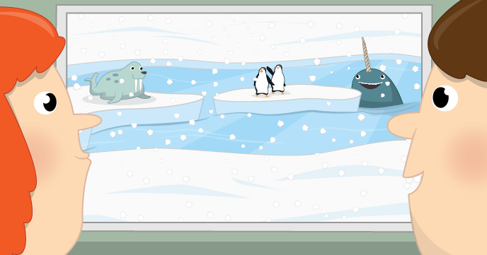

**This is an archived resource.** The repo will remain available but the resource will no longer be maintained or updated. Some or all parts of the resource may no longer work. To see our latest resources, please visit [projects.raspberrypi.org](https://projects.raspberrypi.org).

# Window on the weather

In this resource you will create a Scratch program to check the weather in any city in the world, and create a visualisation of the conditions in Scratch.

## Licence

Unless otherwise specified, everything in this repository is covered by the following licence:

***Window on the weather*** by the [Raspberry Pi Foundation](http://www.raspberrypi.org) is licenced under a [Creative Commons Attribution 4.0 International License](http://creativecommons.org/licenses/by-sa/4.0/).

Based on a work at https://github.com/raspberrypilearning/window-on-the-weather
