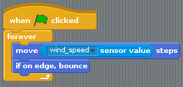
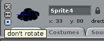

## Blowin' in the wind

-  When it's windy the clouds move faster, so you can use the speed of the wind to alter how fast your cloud moves:

    
    
```blocks
when flag clicked
point in direction (0 v)
go to x: (-190) y: (-150)
+ forever
point towards [mouse-pointer v]
move (1) steps
end
```

-  The cloud bounces as it hits the edge, and then flips upside down. To stop this from happening you need to set the sprite to `do not rotate`, by clicking on the little black square as shown below:



