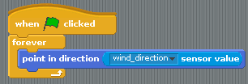

## Wind of change

The wind can change direction, so it would be nice if your script could show the user which direction it's blowing in.

-  You'll need an arrow sprite for this. There's one in the Scratch library, or you could get your own from the web.

-  Add this script to your arrow sprite, so that it points in the direction of the wind:

