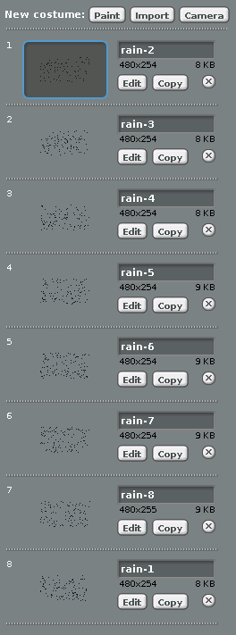
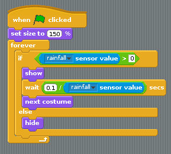

## Make it rain

-  The last bit of weather data to display is the rain. Download [this zip file](images/rain.zip). You can extract the images inside it by typing the following into the terminal:

    ``` bash
    unzip rain.zip
    ```

-  Now make a new sprite by importing the first of the rain images.
-  In the costumes tab, import the other rain images one by one:

    

-  If the rainfall is `0` then the sprite needs to be hidden. If the rainfall is greater than (`>`) `0`, then the sprite should be visible and the costume should constantly change. The time between costume changes can depend on the rainfall, so the more rain there is, the faster the costume will change:



