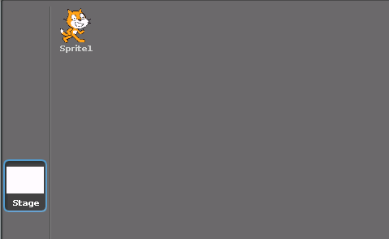
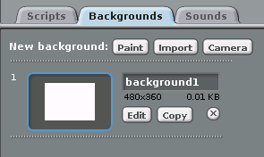

## A room with a view

You're going to need to pick a view from your window to start with.

-  Click on the `Stage` object:

    

-  You can now change the `Background` for the stage. Click on the `Import` button and choose an image that you like. You could even go online and find an image from the web:

