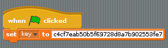
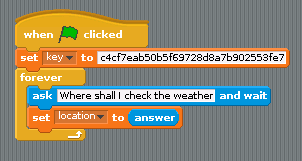
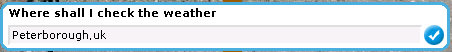
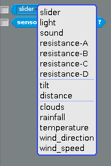

## The *variable* weather

You're going to need a few variables to get this project working.

-  Click on `Make a variable` and call your first variable `key`, then make a second variable called `location`. It's important to spell both variables correctly, and make sure they're all *lowercase*:

    

-  Now you need to use your secret API key. When the green flag is clicked, you need to set the variable `key` to the API key you have copied to your clipboard.

    

-  This *key* will be sent to the Python script, which will then send it to OpenWeatherMap. But to get the weather, OpenWeatherMap also needs to know the city where you want to find the weather. You can keep asking for this information using a `forever` loop, so that the user can keep changing the location where they want to see the weather.

### Testing the API

-  Click on the green flag then type in a city and country code in the dialogue box that appears. Cities should end with a comma. Country codes should be two-letter abbreviations and all in lowercase. There are some examples below:

    

    1.  London,uk
    2.  Nassau,bs
    3.  Sofia,bg
    4.  Berlin,de
    5.  Pyongyang,kp
    6.  Lusaka,ze

-  When you type the city and country code in and press `Enter`, the Scratch program will send the data to the Python script, which will then request the weather from OpenWeatherMap. You can see some of the weather values by clicking on the little black arrow next to the word `slider`. You should be able to see the words `clouds`, `rainfall`, `temperature`, `wind_direction` and `wind_speed`:

    

-  If the values are not there, make sure that the Python script is still running.

