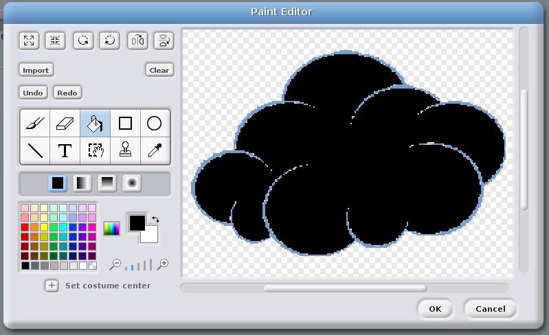

## Little fluffy clouds

-  The percentage cloud cover is stored as `clouds`, and can easily be shown by the transparency of a cloud image.
-  You can find your own cloud image, or use the one below:
  
  

-  The cloud above is a little light in colour, so you could edit the costume and use the fill tool to make it black if you wanted: 
  
  
 
-  In a forever loop, you need to set the ghost effect to `100 - clouds sensor value`. So if there was 20% cloud cover (100 - 20 = 80), the ghost effect would be set to `80`. 
  
  

-  Test out your program by checking different cities and see if the cloud changes.

