Window on the Weather
=====================

Wouldn't it be nice if you could have a magic window, that you could look out of and instantly tell what the weather outside is like, *anywhere in the world*? Well in this resource, that is exactly what you're going to make, and all using the power of the Scratch programming language.

Getting the weather.
--------------------

The first thing you are going to have to do, is get access to a **Weather API**. *API* stands for Application Program Interface! This sounds complicated, but really it's just a set of rules telling for how let your programs talk to other software.

1.  The weather service you're going to use in this resources is called [OpenWeatherMap](http://openweathermap.org/). It is a completely free service, and has an easy to use API. You're going to need your very own account though, so click on the link and head on over to the website.

2.  Click on `Sign Up`

    

3.  Choose a username, type in your email address and then provide a password.

    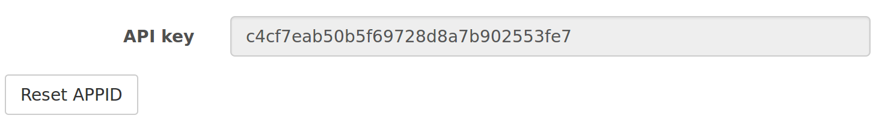

4.  Once you are logged in, you should see a page with your **secret** API key. This is important, so copy it to your clipboard.

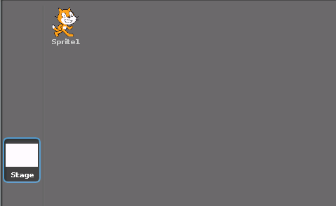

A little help from Python
-------------------------

Scratch 1.4 isn't able to communicate over the internet on it's own, so you're going to need a little Python script to help Scratch communicate with the OpenWeatherMap API.

1.  Open Scratch (`Menu` \> `Programming` \> `Scratch`)

2.  Click on 

3.  Then if you **right** click on the `slider sensor value` block you can select `enable remote senzsor connections` from the context menu that appears.

4.  It's probably a good idea to save this file now. Call it `magic-window`

5.  With Scratch all set up, you can now download [this script](code/weather.py).

6.  You can run this script by opening a terminal and typing:

    ``` python
    python3 weather.py
    ```

    or you could open the file using *IDLE* and then press `F5` to run it.

7.  You must make sure this script is running, or your Scratch program will not work. Every time you want to use your Scratch program, you'll need to run this script first.

A room with a view.
-------------------

You're going to need to pick a view to have out of your window to start with.

1.  Click on the `Stage` object

    

2.  You can now change the `Background` for the stage. Click on the `Import` button and choose an image that you like. You could even go online and find an image from the Web.

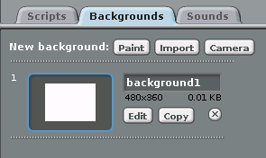

The *variable* weather.
-----------------------

You're going to need a few variables to get this project working.

1.  Click on `Make a variable`, and call your first variable `key`. Then make a second variable called `location`. It is important to spell both variables correctly, and make sure they are all *lowercase*.

    

2.  Now you need to use your super secret API key. When the greenflag is clicked you need to set the variable `key` to the API key you have copied to your clipboard.

    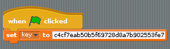

3.  This *key* will be sent to the Python script, which will then send it to OpenWeatherMap. But to get the weather, OpenWeatherMap also needs to know the city you want to find the weather at. You can keep asking for this information, using a `forever` loop, so that the user can keep changing the location they want to see the weather at.

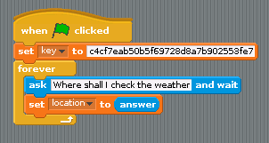

### Testing the API

1.  Click on the `green flag` and then type in a city and country code in the dialogue box that appears. Cities should end with a comma. Country codes should be two-letter abbreviations and all in lowercase. There are some examples below:

    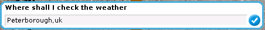

    1.  London,uk
    2.  Nassau,bs
    3.  Sofia,bg
    4.  Berlin,de
    5.  Pyongyang,kp
    6.  Lusaka,ze

2.  When you type the city and country code in, and hit `Enter`, the Scratch program will send the data to the Python script, which will then request the weather from OpenWeatherMap. You can see some of the weather values by clicking on the Little black arrow next to the word `slider`. You should be able to see the words `clouds`, `rainfall`, `temperature`, `wind_direction` and `wind_speed`.

    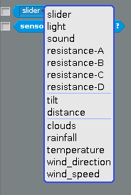

3.  If the values are not there, make sure that the Python script is still running.

Bring me sunshine
-----------------

1.  A good way to indicate the temperature, might be the size of the sun, that can be seen outside the window.
2.  First you need to find a nice picture of the Sun. You can find your own if you like, or use the one below.

    

3.  Click on the button to import a new `Sprite`

    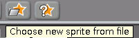

4.  And import you `sun` image. Position your sun, near the top of your screen.

5.  You now need to use the temperature to size the sun. You may wish to play with the values, depending on the size of your sun sprite. In the example below, the sun is sized to the `temperature + 60`. The whole thing is place in a `forever` loop, so that every time you change the city, the temperature is updated.


Little Fluffy Clouds
--------------------

1.  The percentage cloud cover is stored as `clouds`, and can easily be shown by the transparency of a cloud image.
2.  You can find your own cloud image, or use the one below 
3.  The cloud above is a little light in colour, so you could edit the costume, and use the fill tool to make it black if you wanted. 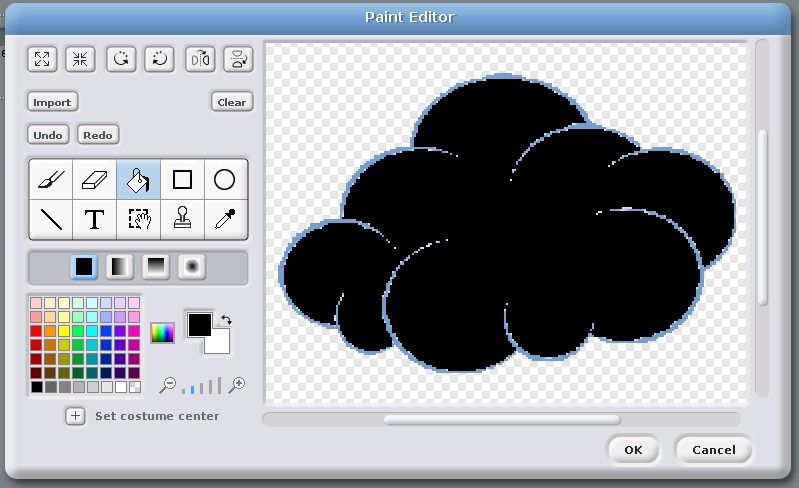
4.  In a forever loop, you need to set the ghost effect to `100 - clouds sensor value`. So if there was 20% cloud cover (100 - 20 = 80), the ghost effect would be set to `80`. 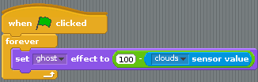
5.  Test out your program by checking different cities and see if the cloud changes.

Blowin' in the wind
-------------------

1.  When it's windy, the clouds move faster, so you can use the speed of the wind to alter how fast your cloud moves.

    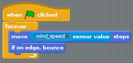

2.  The cloud bounces as it hits the edge, and then flips upside down. T stop this from happening you need to set the sprite to `do not rotate`, by clicking on the little black square as shown below.

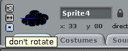

Wind of change
--------------

The wind can change direction, so it would be nice if your script could show the user which direction it is blowing in.

1.  You'll need an arrow sprite for this. There's one in the Scratch library, or you could get your own from the web.

2.  Add this script to your arrow sprite, so that it points in the direction of the wind.

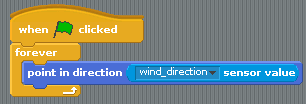

Make it rain
------------

1.  The last bit of weather data to display is the rain. Download [this zip file](images/rain.zip). You can extract the images inside it by typing the following into the terminal.

    ``` bash
    unzip rain.zip
    ```

2.  Now, make a new sprite by importing the first of the rain images.
3.  In the costumes tab, one by one, import the other rain images.

    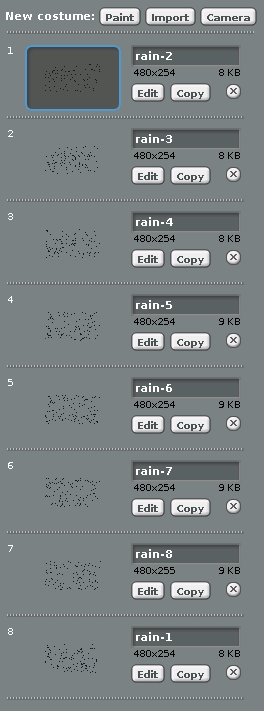

4.  If the rainfall is `0` then the sprite needs to be hidden. If the rainfalls is greater than (`>`) `0`, then the sprite should be visible and the costume should constantly change. The time between costume changes can depend on the rainfall, so the more rain there is the faster the costume will change.

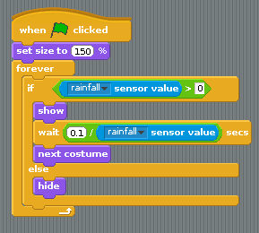

From a Window.
--------------

To finish off your program, you can add a new sprite in, designed to look like a window frame.

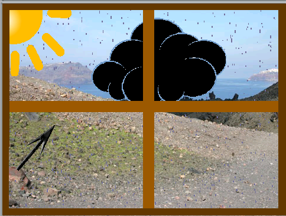

What next?
----------

-   There's lots you could do with this project.
-   Why not try and add in some Physical computing, using LEDs to indicate if it is raining or not?
-   Maybe you could change the backdrop in Scratch so that it matches the country or city that is being requested.
-   You could try and investigate the Python script, and see what other weather data is available.

